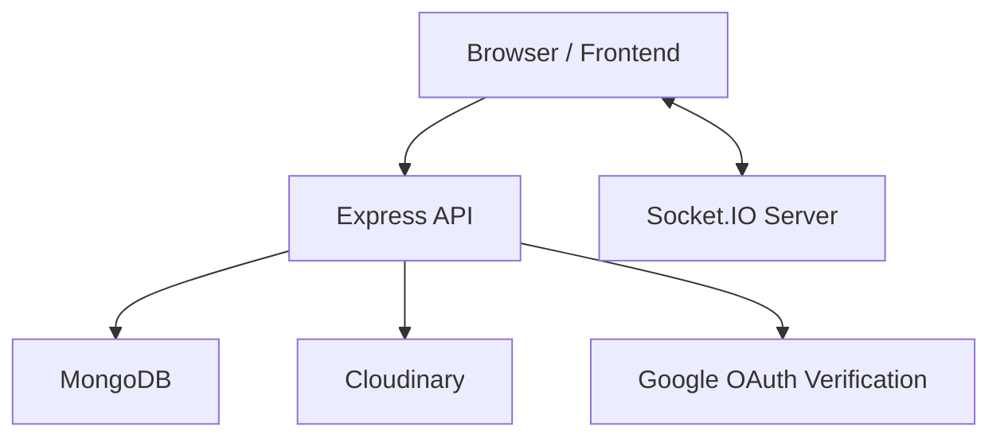
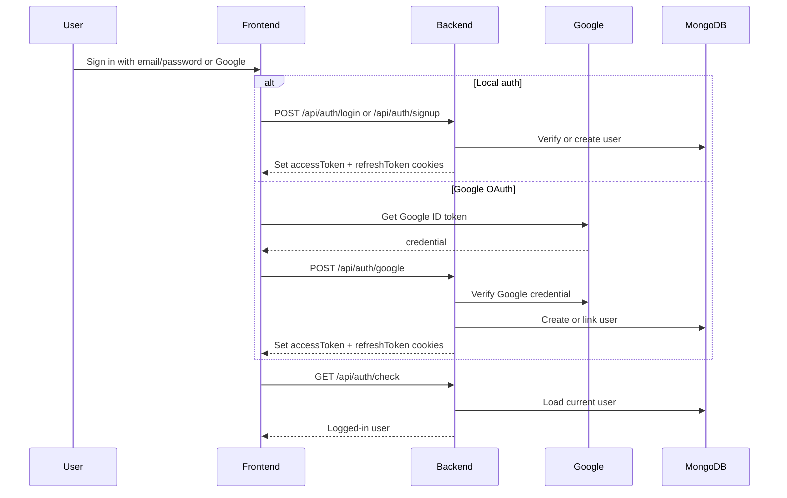
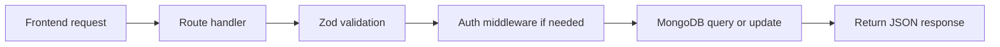
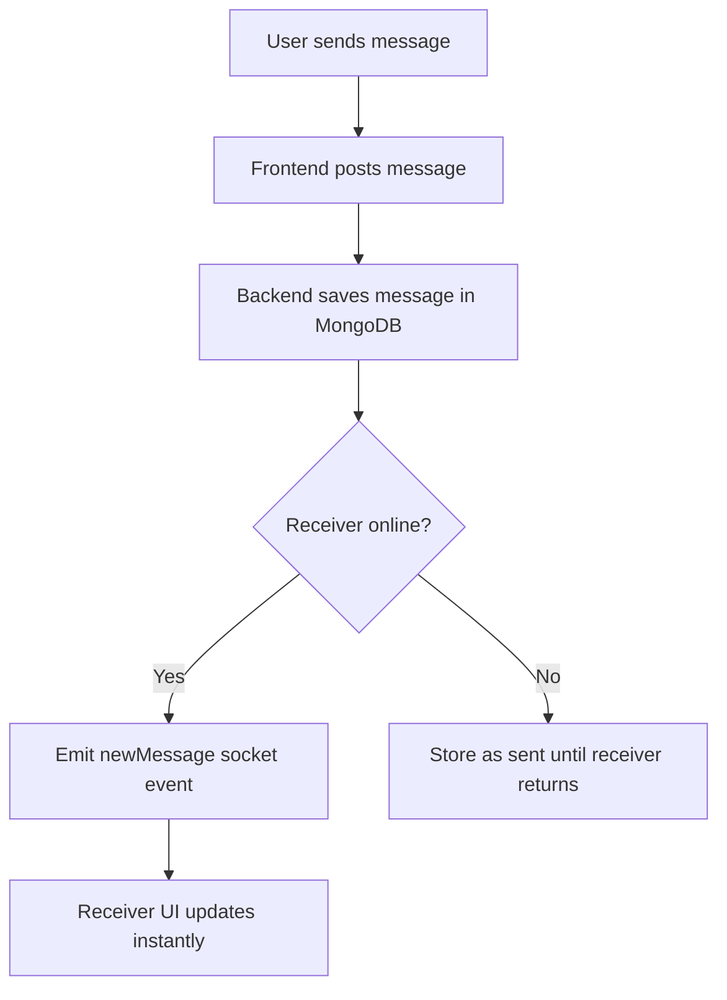

# Fullstack Chat App

A modern real-time chat application built with a TypeScript backend and a React + Vite frontend. It supports private messaging, online presence, unread counts, message delivery status, profile updates, Google OAuth, and token-based authentication with refresh sessions.

The project is designed as a practical production-style fullstack app. It uses HTTP-only cookies for auth, Socket.IO for real-time updates, MongoDB for persistence, and a clean frontend state layer for chat and session handling.

## Highlights

- Real-time one-to-one chat with Socket.IO
- Email/password authentication with JWT cookies
- Google OAuth sign-in with backend verification
- Access token + refresh token session flow
- MongoDB-backed refresh session rotation
- Online user tracking
- Unread message badges
- Message delivery states: sent, delivered, seen
- Profile image upload and user profile page
- Secure HTTP-only cookies
- TypeScript on both backend and frontend
- Zod validation on forms and backend payloads

## Tech Stack

### Backend
- Node.js
- Express
- TypeScript
- MongoDB
- Mongoose
- Socket.IO
- JWT
- bcryptjs
- Zod
- Cloudinary
- cookie-parser
- CORS
- google-auth-library

### Frontend
- React 19
- Vite
- TypeScript
- Zustand
- React Router
- Socket.IO client
- Axios
- Zod
- react-hot-toast
- Tailwind CSS
- DaisyUI
- Lucide React

## Architecture Overview

The app is split into two parts:

- `backend/` handles authentication, message APIs, database writes, refresh sessions, and sockets.
- `frontend/` handles the chat UI, auth forms, real-time listeners, and user interaction.



## Authentication System

The app supports two login methods.

### 1. Local email/password login
- User signs up with full name, email, and password.
- Password is hashed with bcrypt.
- Backend creates auth cookies after successful signup or login.

### 2. Google OAuth login
- User clicks Google sign-in.
- Google returns an ID token to the frontend.
- Frontend sends the token to the backend.
- Backend verifies the token with Google.
- Backend links or creates the user.
- Backend creates the same auth cookies used by local users.

### Token model
- Access token: short-lived token for protected requests
- Refresh token: longer-lived token stored in HTTP-only cookies and in MongoDB refresh sessions
- Legacy `jwt` cookie: still supported during migration for backward compatibility



For a more detailed explanation of auth internals, see [docs/authentication-guide.md](docs/authentication-guide.md).

## Features

### Chat features
- Real-time messaging
- Online status indicators
- Sidebar with all contacts
- Selected chat header
- Read/unread tracking
- Message status ticks for sent, delivered, seen
- Conversation history loading
- Profile pictures in chat bubbles

### Auth and profile features
- Signup and login forms
- Google OAuth sign-in
- Session persistence across refreshes
- Logout
- Profile page
- Profile picture upload

### Data and validation features
- Zod input validation on backend and frontend
- Mongoose schemas for users and messages
- MongoDB refresh session persistence
- Cloudinary-based image uploads
- CORS and cookie-based authentication flow

## Project Structure

```text
Fullstack-Chat-App/
├── backend/
│   ├── src/
│   │   ├── controllers/
│   │   ├── lib/
│   │   ├── middleware/
│   │   ├── models/
│   │   ├── routes/
│   │   └── schemas/
│   ├── .env.example
│   └── package.json
├── frontend/
│   ├── src/
│   │   ├── components/
│   │   ├── pages/
│   │   ├── store/
│   │   ├── lib/
│   │   └── constants/
│   ├── .env.example
│   └── package.json
├── docs/
│   └── authentication-guide.md
├── FEATURE_TICKETS.md
├── notes.txt
└── package.json
```

## Core Backend Flow

### Auth routes
- `POST /api/auth/signup`
- `POST /api/auth/login`
- `POST /api/auth/logout`
- `POST /api/auth/refresh`
- `POST /api/auth/google`
- `PUT /api/auth/update-profile`
- `GET /api/auth/check`

### Message routes
- `GET /api/messages/users`
- `GET /api/messages/:id`
- `POST /api/messages/send/:id`



## How Real-Time Chat Works

1. The frontend logs in the user and stores the returned auth state.
2. The frontend connects Socket.IO using the authenticated user ID.
3. The backend stores the socket connection in a user-to-socket map.
4. When one user sends a message, the backend emits a socket event to the recipient.
5. The frontend updates the chat UI instantly.
6. Delivery and seen events are emitted back to the sender.



## Authentication and Session Handling

### What happens after login
- Backend sets secure HTTP-only cookies.
- Frontend calls `/api/auth/check` on app load.
- If the cookies are valid, the user session is restored.
- Frontend connects the socket automatically.

### What happens when the access token expires
- Frontend can call `/api/auth/refresh`.
- Backend validates the refresh token.
- Backend verifies the refresh session in MongoDB.
- Backend issues a new access token.
- User stays logged in without re-entering credentials.

### Why this is safe
- Tokens are not stored in localStorage.
- Cookies are HTTP-only.
- Refresh sessions can be revoked.
- Google OAuth tokens are verified server-side.

## Frontend Pages

- `LoginPage` for email/password login and Google sign-in
- `SignUpPage` for account creation and Google sign-in
- `HomePage` for the main chat interface
- `ProfilePage` for profile details and avatar updates
- `SettingsPage` for app settings

## Important Frontend Stores

- `useAuthStore` manages session state, login/logout, socket connection, and profile updates
- `useChatStore` manages users, messages, unread counts, and message subscriptions
- `useThemeStore` manages the active theme

## Environment Variables

### Backend `.env`
Create `backend/.env` from `backend/.env.example`.

Required values:
- `MONGO_URL`
- `PORT`
- `JWT_SECRET`
- `CLOUDINARY_CLOUD_NAME`
- `CLOUDINARY_API_KEY`
- `CLOUDINARY_API_SECRET`
- `GOOGLE_CLIENT_ID`
- `CORS_ORIGIN`
- `NODE_ENV`

### Frontend `.env`
Create `frontend/.env` from `frontend/.env.example`.

Required values:
- `VITE_GOOGLE_CLIENT_ID`

## Setup Instructions

### 1. Clone the repository
```bash
git clone <your-repo-url>
cd Fullstack-Chat-App
```

### 2. Install dependencies
```bash
npm install
npm install --prefix backend
npm install --prefix frontend
```

### 3. Set up environment files
- Copy `backend/.env.example` to `backend/.env`
- Copy `frontend/.env.example` to `frontend/.env`
- Fill in all values

### 4. Start the backend
```bash
npm run dev --prefix backend
```

### 5. Start the frontend
```bash
npm run dev --prefix frontend
```

### 6. Open the app
- Frontend: `http://localhost:5173`
- Backend: `http://localhost:5001`

## Available Scripts

### Root
- `npm run build` installs backend and frontend dependencies and builds the frontend
- `npm run start` starts the backend

### Backend
- `npm run dev`
- `npm run start`
- `npm run typecheck`

### Frontend
- `npm run dev`
- `npm run build`
- `npm run lint`
- `npm run preview`
- `npm run typecheck`

## Google OAuth Setup

To use Google sign-in:

- Create a Google OAuth client in Google Cloud Console
- Use a **Web application** client type
- Add your frontend origin to authorized JavaScript origins
- Set `VITE_GOOGLE_CLIENT_ID` in the frontend
- Set `GOOGLE_CLIENT_ID` in the backend
- Keep `CORS_ORIGIN` aligned with the frontend origin

For this project’s current implementation, redirect URIs are not required because the frontend receives a Google ID token and the backend verifies it directly.

## Notes on Security and Reliability

- Keep `.env` files out of git
- Use `.env.example` files for sharing required variables
- Do not commit secrets
- Use HTTPS in production
- Keep same-site cookie settings aligned with deployment topology
- Rotate MongoDB credentials if a secret was ever exposed outside local development

## Roadmap

The project is already built around a strong base. Natural next steps include:
- Pagination for message history
- Search in conversations
- Reply to specific message
- Edit and delete messages
- File sharing
- Group chats
- Push notifications
- Multi-device session management
- GitHub OAuth support if needed later

## Why This Project Stands Out

- It is not just a UI demo; it has a real backend, database, sockets, and session model.
- It supports both local auth and Google OAuth.
- It uses secure cookies instead of exposing tokens to the browser.
- It keeps sessions persistent with refresh token rotation.
- It is organized for real-world expansion.

## Short Version

If someone asks what this project is:

> A TypeScript-based real-time chat app with JWT auth, Google OAuth, refresh-token sessions, Socket.IO messaging, profile management, and a clean React frontend.

## License

No license has been specified yet.
