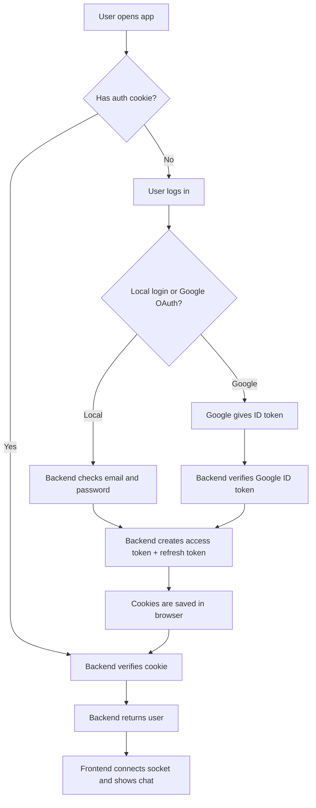
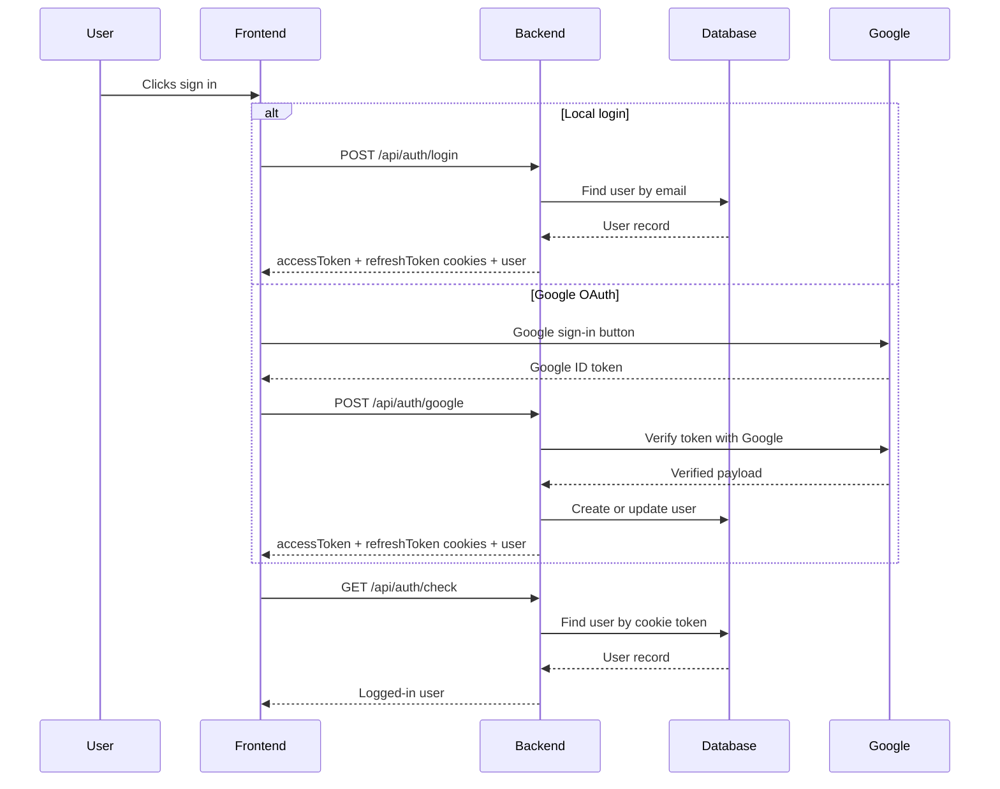
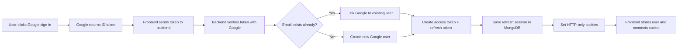
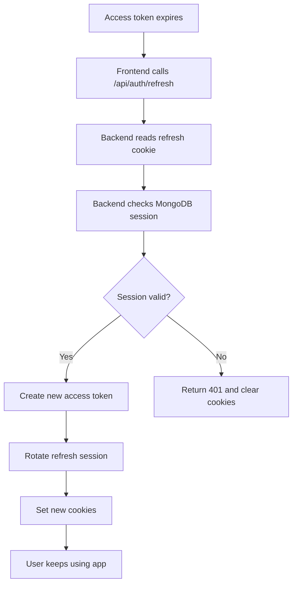
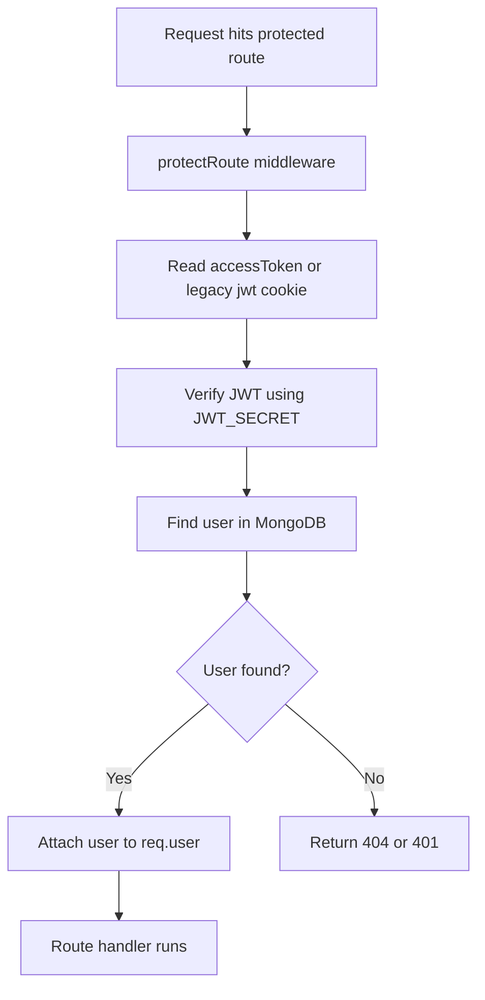

# Authentication Guide

This guide explains how authentication works in this project in a very simple way.

It covers:
- Local email/password login with JWT
- Google OAuth login
- Access tokens and refresh tokens
- How cookies are used
- How the frontend and backend work together
- Why avatars and user data still show correctly after OAuth

## Big Picture

There are two ways a user can sign in:

1. Local auth
- User signs up with email, full name, and password.
- Backend checks the password.
- Backend creates auth cookies.

2. Google OAuth
- User clicks Google sign-in.
- Google confirms the user identity.
- Backend verifies the Google ID token.
- Backend creates the same auth cookies that local users get.

The important idea is this:
- OAuth is only the login method.
- JWT and refresh tokens are still used by your app to manage the session.

## Simple Flow

## What JWT Means Here

JWT means JSON Web Token.

In this project, JWT is used to prove that a user is authenticated.

There are three token-related pieces:

- Legacy JWT cookie: the original cookie name was `jwt`
- Access token cookie: short-lived token used for normal app requests
- Refresh token cookie: longer-lived token used to create a new access token when the old one expires

### Why use JWT?

JWT is useful because:
- It is small and fast
- It can be stored in a secure cookie
- The backend can verify it without keeping a server session for every request

### How the legacy JWT works

Before refresh tokens were added, the app used one cookie:
- Cookie name: `jwt`
- Expiry: 7 days
- It contained the user ID signed with `JWT_SECRET`

That old cookie is still accepted during migration so existing users do not break.

## How the New Token System Works

Now the app uses two cookies for the real session flow:

- `accessToken`
- `refreshToken`

### Access token
- Short-lived
- Used on normal protected requests
- If it expires, the app can use the refresh token to get a new one

### Refresh token
- Longer-lived
- Stored in an HTTP-only cookie
- Also stored in MongoDB as a refresh session record
- Used to mint a new access token

## Token Flow

## Local Email/Password Login

### Signup flow
1. User fills full name, email, and password.
2. Frontend validates the form with Zod.
3. Frontend sends data to `POST /api/auth/signup`.
4. Backend validates again with Zod.
5. Backend hashes the password using bcrypt.
6. Backend creates the user in MongoDB.
7. Backend creates auth tokens.
8. Backend sets cookies in the browser.
9. Frontend stores the returned user in state and connects the socket.

### Login flow
1. User enters email and password.
2. Frontend validates with Zod.
3. Frontend sends data to `POST /api/auth/login`.
4. Backend checks the user.
5. Backend compares the password with bcrypt.
6. Backend creates new auth cookies.
7. Frontend sets the user in state and connects the socket.

## Google OAuth Flow

### What happens in the browser
1. The Google sign-in button appears.
2. User clicks it.
3. Google returns a Google ID token to the frontend.
4. Frontend sends that token to `POST /api/auth/google`.

### What happens in the backend
1. Backend validates the request body with Zod.
2. Backend verifies the Google token using `google-auth-library`.
3. Backend checks that Google says the email is verified.
4. Backend looks for an existing user with the same email.
5. If the user exists, backend links the Google account to that user.
6. If the user does not exist, backend creates a new user with Google provider fields.
7. Backend creates access and refresh tokens.
8. Backend stores the refresh session in MongoDB.
9. Backend sets cookies.
10. Frontend receives the same kind of user object that local login returns.

### OAuth flow diagram

## Refresh Token Flow

Refresh tokens solve the problem of expired access tokens.

### Why refresh tokens are needed
- Access tokens are short-lived for security
- Short-lived tokens expire often
- Without a refresh token, users would log in again too often

### Refresh flow
1. Access token expires.
2. Frontend requests `/api/auth/refresh`.
3. Backend reads the refresh token cookie.
4. Backend checks if the refresh session exists in MongoDB.
5. Backend checks if the session is not revoked.
6. Backend issues a new access token.
7. Backend rotates the refresh session.
8. Backend updates the cookies.
9. User stays logged in.

### Refresh token diagram

## Cookies Used in the App

The app uses HTTP-only cookies.

### Why HTTP-only cookies?
- JavaScript in the browser cannot read them directly
- That makes them safer against many XSS attacks
- The browser sends them automatically with requests

### Cookies in this project
- `accessToken`: short-lived session token
- `refreshToken`: long-lived token for session renewal
- `jwt`: legacy cookie kept during migration

## Backend Protection Flow

Protected routes use `protectRoute`.

### What protectRoute does
1. Reads the auth cookie.
2. Verifies the JWT signature.
3. Finds the user in MongoDB.
4. Removes the password from the returned user.
5. Sets `req.user`.
6. Allows the request to continue.

### Protected route diagram

## Frontend Side

The frontend does three important things.

### 1. It keeps auth state
`useAuthStore` stores:
- `authUser`
- loading flags
- socket connection
- sign-in and sign-out actions

### 2. It checks auth on app start
When the app loads:
- `App.tsx` calls `checkAuth()`
- Frontend asks the backend if the cookie is valid
- If yes, the user is logged in automatically

### 3. It connects the socket after login
After login or auth check:
- Frontend reads `authUser._id`
- Frontend connects Socket.IO with that user ID
- Chat messages and online status work

## Why OAuth Users Show an Avatar Too

OAuth users now also get a visible profile picture.

### What was wrong before
Some OAuth users had an empty `profilePic` value. That made the UI show the generic fallback image or no avatar in some views.

### What fixed it
The backend now normalizes profile pictures.
- If `profilePic` exists, it is used.
- If `profilePic` is empty, the backend generates a fallback avatar URL.

So now:
- Sidebar shows a user icon for every user
- Chat header shows the selected user image
- Message bubbles show the correct avatar

## What Happens on Logout

1. Frontend calls `POST /api/auth/logout`.
2. Backend revokes the refresh session if one exists.
3. Backend clears access, refresh, and legacy cookies.
4. Frontend clears auth state and disconnects the socket.

## Simple Everyday Explanation

Think of the system like this:

- Google OAuth is the way someone proves who they are.
- JWT access token is the short hall pass for using the app.
- Refresh token is the backup hall pass that makes a new short hall pass when the first one expires.
- Cookies are the pockets where the app keeps those passes.
- MongoDB refresh sessions are the list of backup passes that are allowed.

So the app works like this:
- Login once
- Stay logged in
- Use the app normally
- Get refreshed automatically when needed

## Files Involved

### Backend
- `backend/src/controllers/auth.controller.ts`
- `backend/src/middleware/auth.middleware.ts`
- `backend/src/lib/utils.ts`
- `backend/src/models/user.model.ts`
- `backend/src/models/refreshSession.model.ts`
- `backend/src/routes/auth.route.ts`
- `backend/src/index.ts`
- `backend/src/controllers/message.controller.ts`

### Frontend
- `frontend/src/store/useAuthStore.ts`
- `frontend/src/store/useChatStore.ts`
- `frontend/src/components/GoogleAuthButton.tsx`
- `frontend/src/pages/LoginPage.tsx`
- `frontend/src/pages/SignUpPage.tsx`
- `frontend/src/components/Sidebar.tsx`
- `frontend/src/components/ChatHeader.tsx`
- `frontend/src/components/ChatContainer.tsx`
- `frontend/src/pages/ProfilePage.tsx`

## Short Summary

- Local auth uses email and password.
- OAuth uses Google sign-in.
- Both end up creating the same app session.
- Access token handles normal requests.
- Refresh token keeps the user signed in.
- Backend and frontend both rely on the same user object.
- Avatar fallback makes every user visible in the UI.

If you want, I can also add a second document that explains only the OAuth flow in even simpler words, or I can add links to this guide from the backend and frontend READMEs.